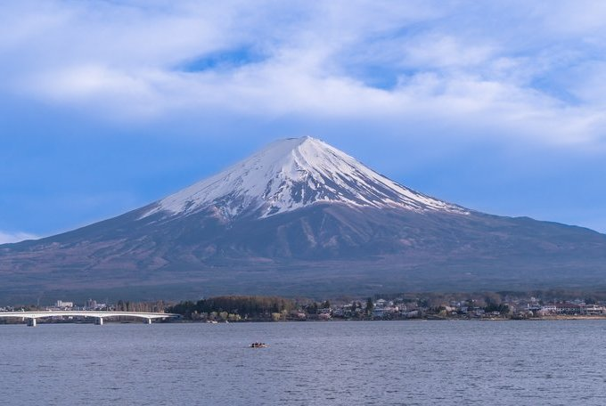

## 心灵场所、文化象征与地理奇观

[富士山](https://www.japan-travel.cn/spot/1308)海拔 3,776 米，是日本的最高峰，由大约 100,000 年前的火山活动形成。如今，富士山及周边地区已成为集登山、露营与休闲于一体的娱乐胜地。

富士山是日本最具代表性的象征之一，全球各地的游客纷纷涌入[静冈](https://www.japan-travel.cn/destinations/tokai/shizuoka/)县与[山梨](https://www.japan-travel.cn/destinations/tokai/yamanashi/)县，只为一睹这座令人惊叹的高山。不过，[富士山](https://www.japan-travel.cn/fuji-guide/mt-fuji-more-than-a-mountain/)一直都是日本人的心灵圣地和艺术灵感的源泉。

### 崇敬的对象

数世纪以来，日本人与富士山已建立了心灵的连结。传说知名的苦行僧长谷川角行 (1541-1646) 曾成功登上富士山山顶 100 多次。他的事迹促成了"富士子"的形成，富士子是一群志同道合的富士山崇拜者。此宗派团体以建立神社、打造石碑与斋戒来表达他们对信仰的执着。他们的狂热最终导致德川幕府下令禁止此宗派。尽管如此，日本的山岳崇拜传统依然受到推崇，富士山更被尊为重要的心灵圣地。

### 朝圣之地

每年夏天都会有二三十万人攀登[富士山](https://www.japan-travel.cn/fuji-guide/mt-fuji-climbing-guide/)。在日出之时登顶很受欢迎——登山者通常在前一天开始登山，在山上的一个小屋里过夜，然后第二天一大早就开始爬山，看太阳从地平线上升起。在近代以前，富士山是修验者（山岳崇拜苦修信仰——修验道的修行者，）接受训练的地方，甚至下层阶级也会来这里朝圣。富士山脚下的多座神社也证明了富士山在信仰和历史方面的重要地位。

### 文化象征

富士山最具代表性的形象最早可追溯至江户时代 (1603-1867)。木版画家葛饰北斋与歌川广重创作了一系列与[富士山](https://www.japan-travel.cn/fuji-guide/mt-fuji-more-than-a-mountain/)有关的作品，以不同角度与背景描绘了富士山的模样，让世界各地的人都能一睹当地风采及生活方式。葛饰北斋尤以对西方画家梵高的影响闻名于世，甚至对作曲家德彪西也产生了一定影响。富士山的绝美景致在江户时代风靡一时，为其成为全球瞩目的珍贵遗产奠定了基础。

### 地理奇观

富士山大约形成于 100,000 年前，反复的火山喷发使其成为了日本最大的山峰，海拔 3,776 米。最后一次的喷发是在 1707 年，总计持续了 16 天，火山灰最远飘散到了东京。宝永山（富士山的次峰之一）、山脚下的富士五湖以及青木原附近的许多洞穴亦是火山活动的结果。此地区地理条件得天独厚，拥有许多富含矿物质的温泉，成为了户外休闲的天堂。
